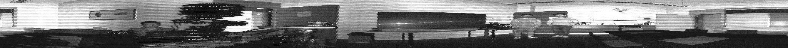
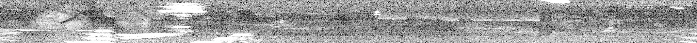
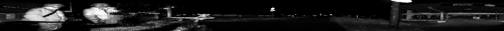
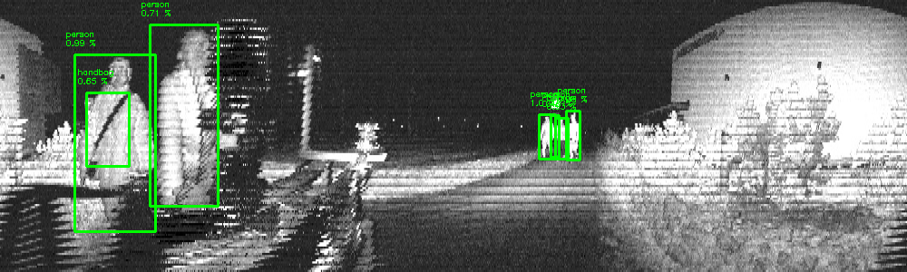
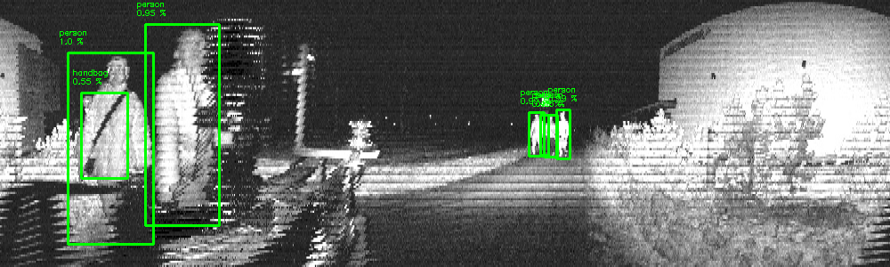
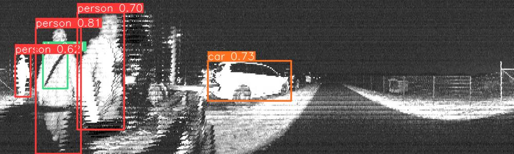
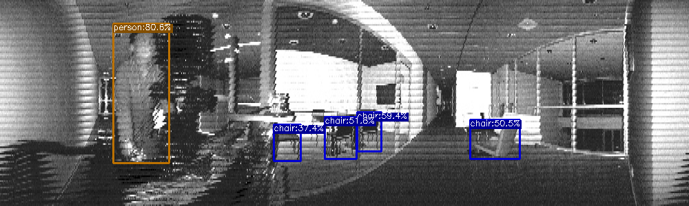
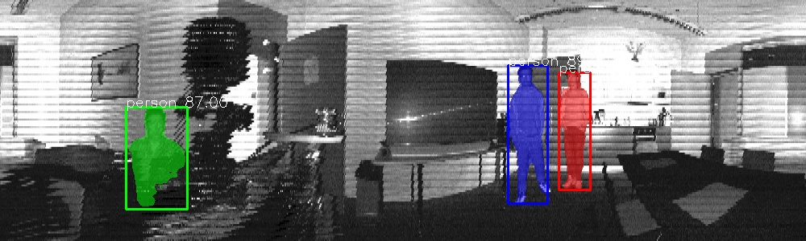
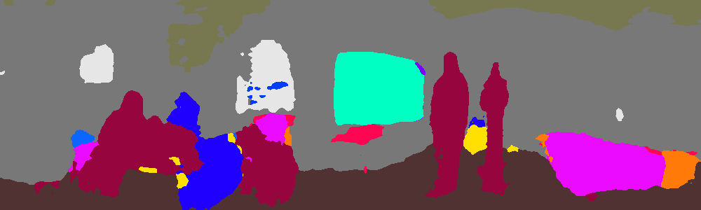

# Analyzing lidar-as-a-camera sensor 'images'

Analysis of object detectors and image segmentation models on images from lidar sensors

## Introduction

This work explores the potential of general-purpose DL perception algorithms, specifically detection and segmentation neural networks, for processing image-like outputs of advanced lidar sensors. We focus on low-resolution images with 360º field of view obtained with lidar sensors by encoding depth, reflectivity, or near-infrared light in the image pixels.

## Ouster Lidar Generated Images

## Approaches
### Detection
#### YOLOx

[YOLOx github link](https://github.com/Megvii-BaseDetection/YOLOX)
### Segmentation

## Detection Examples
### Faster R-CNN

### Mask R-CNN

### YOLOv 5

### YOLOx

## Segmentation Examples
### PointRend

### HRNet

